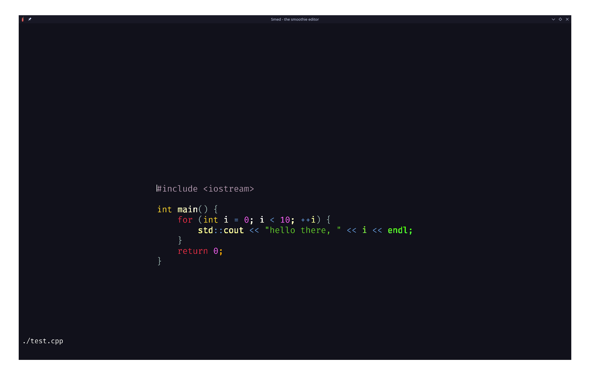

# SMed

The Smooth Lightweight editor that runs **SM**ooth like a **SM**oothie.

## Features:

- Buttery **sm**ooth navigation and camera panning!
- No Mouse -> Training you to finally switch to VIM
- Copy/Paste
- Syntax Highlighting in C/C++
- Find/Replace
- File Explorer
- Highlighting

## Building:

- Clone the repo and its subrepos.
- Build omega
  - Run the following:

```bash
  cd lib/omega/
  ./configure.sh
  ./build.sh
```

- In the root project, run `./build.sh`
- Open any file/directory using `./build/smed <file/directory name>`

## Usage

- There are by default 3 modes, editing, searching, and file exploring
- Type any key as you would in a text editor

| Key                  | Effect                                   |
| -------------------- | ---------------------------------------- |
| Ctrl-s               | Save to current file                     |
| Ctrl-left/Ctrl-right | Jump to prev/next token                  |
| Ctrl-f               | Find                                     |
| Ctrl-q               | Quit                                     |
| Ctrl-o               | Open file explorer                       |
| Ctrl-n               | Create a new file in file exploring mode |
| esc                  | Exits from searching mode                |
| Ctrl-c/Ctrl-v/Ctrl-x | Classic copy, paste, cut                 |
| n                    | Next result in searching mode            |
| Ctrl-+               | Zoom in                                  |
| Ctrl--               | Zoom out                                 |



Here are some interesting reference papers/articles:

## Text Sequences & Buffers

- [Charles Crowley Data Structures for Text Sequences](https://www.cs.unm.edu/~crowley/papers/sds.pdf)

- [Gap Buffer](https://en.wikipedia.org/wiki/Gap_buffer)

- [The Craft of Text Editor by Craig A. Finseth](https://www.finseth.com/craft/index.html)

- [Gap Buffers vs Ropes](https://coredumped.dev/2023/08/09/text-showdown-gap-buffers-vs-ropes/)

- [Amortized analysis](https://en.wikipedia.org/wiki/Amortized_analysis)

## Lexers

- [Crafting Interpreter's](https://craftinginterpreters.com/contents.html)

- [Tsoding's Implementation](https://www.youtube.com/watch?v=AqyZztKlSGQ&list=PLpM-Dvs8t0VZVshbPeHPculzFFBdQWIFu&index=15&pp=iAQB)

  - my own implementation heavily used his as a foundation

- [The definitive compiler "Bible": The Dragon Book](https://en.wikipedia.org/wiki/Compilers:_Principles,_Techniques,_and_Tools)

```

```
